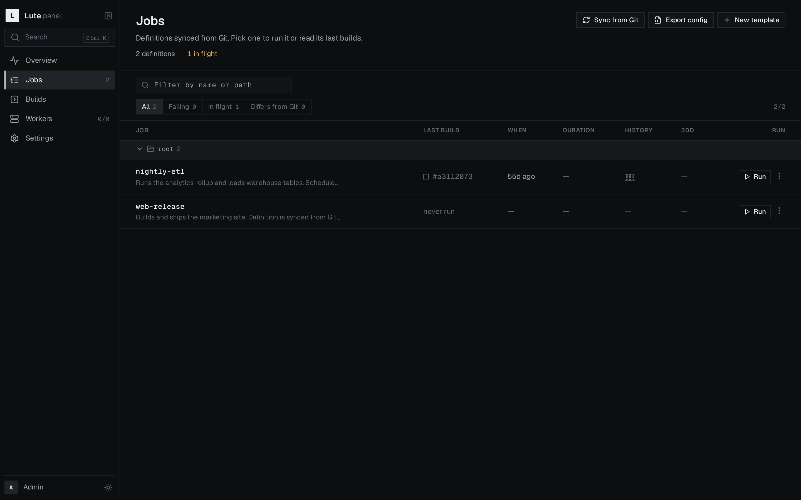

# Lute

Lute is an attempt at an alternative to [Jenkins](https://github.com/jenkinsci/jenkins), fixing the
problems it has:

- Stability and predictability
- Configuration as Code out of the box
- Rich, easy-to-use form builders instead of tons of poorly supported plugins
- Stateless core
- Modern SDKs instead of legacy Groovy pipelines
- ... and many more

> **Status: early work in progress.** Lute is a weekend project, it has no users yet and no stable
> release. Expect breaking changes without deprecation.



## How it works

Three pieces, each one doing one thing:

```
browser ──▶ admin (nginx SPA) ──/api──▶ core (HTTP + WS) ──▶ postgres
workers ───────────────── gRPC ───────▶ core (:50051)
```

- **core** — stateless Go backend. REST + WebSocket for the panel, gRPC for workers. Everything
  durable (domain data *and* the job queue) lives in Postgres, so core can be restarted or scaled
  out freely.
- **admin** — React/TypeScript panel (Vite, Tailwind, TanStack Query). Trigger jobs, watch builds
  stream in, manage workers.
- **worker** — a single Go binary. It claims itself against core with a claim code, then pulls work
  for the queues and labels it advertises.

**Git is the source of truth for job definitions.** YAML under `infrastructure/dev/jobdefs/` is
synced into Postgres on startup and on demand; the panel shows what drifted from Git and can export
the current state back as YAML to commit.

A job definition declares its queue, labels, runtime, command and a typed parameter schema — the
panel renders the run form from that schema, so there is no plugin to install for a select box or a
secret field:

```yaml
name: web-release
description: Builds and ships the marketing site.
queue: deploy
labels:
  region: eu
runtime: node:25-alpine
command: ./scripts/ship.sh
parameters:
  - name: environment
    type: select
    label: Target environment
    env: ENVIRONMENT
    required: true
    default: staging
    options:
      - { value: staging, label: Staging, tone: warning }
      - { value: prod, label: Production, tone: danger }
  - name: dry_run
    type: bool
    label: Dry run
    env: DRY_RUN
    default: true
```

## Quick start

Requirements: Docker + Docker Compose, Go 1.26+ and Node 25.x if you want to build outside Docker.

```bash
git clone https://github.com/notna-k/Lute.git && cd Lute
cp .env.example .env     # set JWT_SECRET (>= 32 bytes), ADMIN_EMAIL, ADMIN_PASSWORD
make dev-up              # postgres + core + admin
```

- Panel: http://localhost:8080 (sign in with `ADMIN_EMAIL` / `ADMIN_PASSWORD`)
- Core API: http://localhost:8081/api/health
- gRPC for workers: `localhost:50051`

Then add a worker — *Add worker* in the panel hands you a claim code:

```bash
make worker-build
./worker/bin/lute-worker setup --claim-code <code> --api http://localhost:8081
./worker/bin/lute-worker logs -f     # setup registers the host and starts the agent
```

`make dev-logs` tails the stack, `make dev-down` stops it, `make dev-clean` also wipes Postgres.
More detail, including every environment variable, is in
[`infrastructure/dev/README.md`](infrastructure/dev/README.md).

## Repository layout

| Path | What lives there |
|------|------------------|
| [`api/`](api/) | Core backend (Go module `github.com/lute/api`) |
| [`worker/`](worker/README.md) | Worker binary (Go module `github.com/lute/worker`) |
| [`ui/`](ui/README.md) | Admin panel (React + Vite) |
| [`shared/proto/`](shared/README.md) | gRPC contract shared by core and workers |
| [`infrastructure/dev/`](infrastructure/dev/README.md) | Dev compose stack and example job definitions |

## Contributing

Issues, ideas and pull requests are welcome — see [CONTRIBUTING.md](CONTRIBUTING.md). AI-assisted
contributions are fine; the same review bar applies either way.

## License

[MIT](LICENSE) © Anton Mahdysyuk
