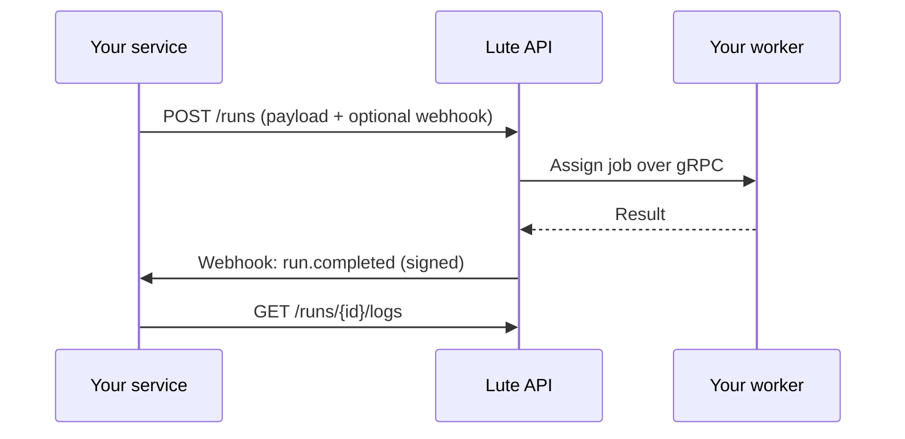

## What Lute is

Lute runs code on workers you control, triggered by a REST API. You enqueue a
**run**, one of your workers picks it up, executes the payload, and reports
the result. If you have asked for a webhook, Lute sends you a signed HTTP
callback when the run finishes.

You can think of the platform as three pieces:

- **Control plane** — the REST API documented here. You send `POST /runs`,
  `GET /runs/{id}`, and so on, using a personal API key.
- **Workers** — long-running agents you register with Lute. They connect to
  the control plane over a persistent channel and execute the runs you
  enqueue.
- **Integrations** — the optional webhook callbacks, job logs, and execution
  metadata you use to stitch Lute into your own system.

## What a typical integration looks like

## Reading order

If this is your first integration, read the pages below in order. Each one is
short and stands alone.

1. [Authentication](/authentication) — how to create and use an API key.
2. [Runs](/runs) — the lifecycle of a run and every relevant endpoint.
3. [Webhooks](/webhooks) — how to receive and verify event callbacks.
4. [Idempotency](/idempotency) — retries without duplicate side effects.
5. [Errors](/errors) — response shape and what to do on each status.

If you already have an OpenAPI-based toolchain, generate your client from
[`openapi.yaml`](/api-reference) and skim the guides for the concepts only.
