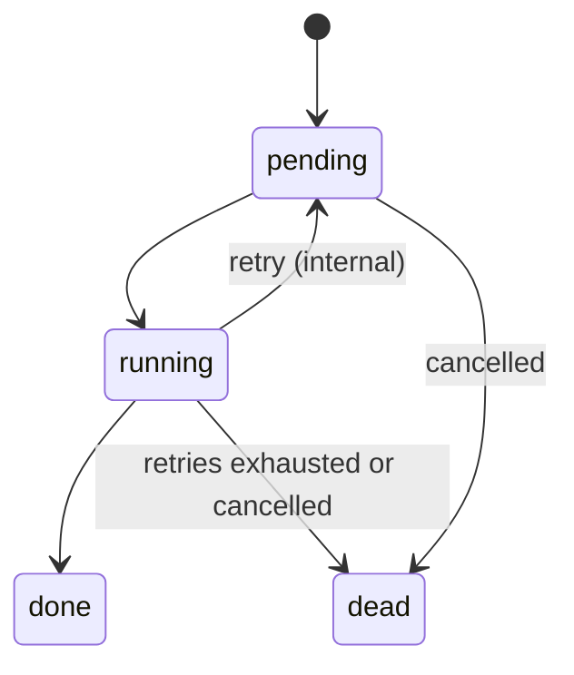

A **run** is a single request to execute a payload on one of your workers. A
run moves through a small set of states: `pending`, `running`, `done`, or
`dead`. The API lets you trigger runs, read their current state, inspect
worker-side logs, and retry or cancel them.

## The run lifecycle



Internal retries (driven by `max_retries`) never send a `run.failed`
webhook; only the terminal `dead` state does. See [Webhooks](/webhooks) for
the exact event matrix.

## Create a run

```bash
curl https://api.lute.app/api/public/v1/runs \
  -H "Authorization: Bearer $LUTE_API_KEY" \
  -H "Content-Type: application/json" \
  -d '{
    "queue": "default",
    "type": "container",
    "payload": {
      "source_repository": "github.com/acme/job",
      "runtime": "python:3.12-slim",
      "command": "python main.py"
    },
    "max_retries": 3,
    "timeout_sec": 900,
    "idempotency_key": "daily-2026-04-16",
    "webhook": {
      "url": "https://your.app/lute/webhook",
      "events": ["run.completed", "run.failed"]
    }
  }'
```

The response returns the run with a status of `pending` and, when Lute
generated the webhook signing secret for you, a one-time `webhook_secret`
you must store for signature verification.

## Read a run

`GET /runs/{id}` returns the current state plus, once the run finishes, the
elapsed milliseconds and worker id. The same `{id}` works for all follow-up
endpoints.

## List your runs

`GET /runs?queue=default&type=container&limit=50&offset=0` returns a
newest-first page of runs you own, with a total count for pagination.

## Retry a run

`POST /runs/{id}/retry` re-enqueues a previously finished or dead run with
its original payload, resetting attempts to zero. You can only retry a run
whose queue/job record Lute still has in its SQLite-backed queue store; once that record is gone
record, retry returns `404` and you must create a new run.

## Cancel a pending run

`DELETE /runs/{id}` removes the run from its queue if it has not started
yet. Running jobs cannot be cancelled mid-flight through this endpoint — use
a timeout (`timeout_sec`) or an application-level stop signal for that.

## Read logs

`GET /runs/{id}/logs?direction=tail&limit=200` streams worker-side log
lines. `direction=head` returns the first lines, `direction=tail` the last.
Logs are only available while the worker still has the run on disk.
